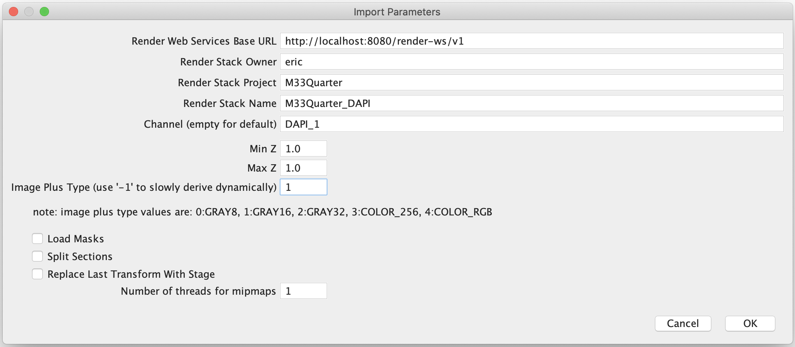

# Export data from render

## TrakEM2 Plugin

Render includes a [TrakEM2 plugin](https://github.com/saalfeldlab/render/blob/master/docs/src/site/markdown/trakem2-scripts.md) for import to, and export from, TrakEM2.

The plugin can be downloaded [here](TODO) and installed by copying to the `plugins` inside the `Fiji` directory (or `Fiji.app` on macOS.)

Once installed, Fiji will have an option `New -> TrakEM2 from )Render Web Services)`. The first choice is to select a directory where the project will be created (you will need to create this directory outside of Fiji). 

## Download script

[`cutout.sh`](../misc/cutout.sh) is a shell script which will pull a stack of 16-bit PNGs from render.

Edit the script settings (render details, stack details, channel list) and run. Images will be rasterized on the render server and downloaded locally.
